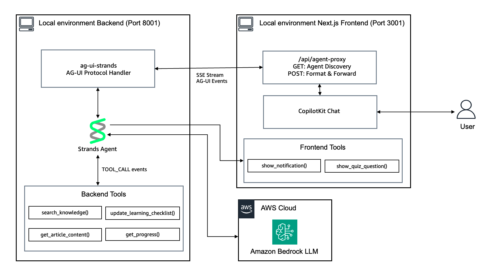

# AG-UI Protocol Integration with Strands Agents

A sample demonstrating how to build rich, interactive AI chat experiences using Strands Agents SDK with AG-UI protocol and CopilotKit frontend. The sample app is an AgentCore documentation assistant that helps users learn about Amazon Bedrock AgentCore.

## Overview

### Sample Details

| Information            | Details                                                    |
|------------------------|------------------------------------------------------------|
| **Agent Architecture** | Single-agent                                               |
| **Native Tools**       | None                                                       |
| **Custom Tools**       | search_knowledge, get_article_content, update_learning_checklist, get_checklist_progress |
| **Frontend Tools**     | show_notification, show_quiz_question                      |
| **MCP Servers**        | None                                                       |
| **Use Case Vertical**  | Developer Education                                        |
| **Complexity**         | Intermediate                                               |
| **Model Provider**     | Amazon Bedrock                                             |
| **SDK Used**           | Strands Agents SDK, ag-ui-strands, CopilotKit              |

### Architecture



The sample consists of a Python backend agent and a Next.js frontend that communicate via the AG-UI protocol (Server-Sent Events). The frontend uses CopilotKit hooks to enable bidirectional state sync, frontend tool execution, and custom UI rendering for tool results.

### Key Features

- **Frontend Tool Calls**: Agent triggers browser-side actions like toast notifications and interactive quizzes
- **Shared State (useCoAgent)**: Bidirectional state synchronization between agent and UI for the learning checklist
- **Generative UI**: Custom React components render tool results inline in the chat
- **Local Knowledge Base**: Markdown files provide AgentCore documentation for RAG-style retrieval

## Prerequisites

- Python 3.12+
- Node.js 20+
- [uv](https://docs.astral.sh/uv/getting-started/installation/) for Python dependency management
- AWS CLI configured with appropriate credentials
- [Model access](https://docs.aws.amazon.com/bedrock/latest/userguide/model-access-modify.html) enabled for Anthropic Claude Sonnet 4.6 (or your preferred model)

## Setup

1. **Configure environment variables:**
   ```bash
   cp .env.example .env
   # Edit .env with your configuration (optional - defaults work for local dev)
   ```

2. **Install agent dependencies:**
   ```bash
   cd agent
   uv sync
   ```

3. **Install frontend dependencies:**
   ```bash
   cd frontend
   npm install
   ```

## Usage

**Quick start (both services):**
```bash
./start.sh
```

**Or start individually:**

**Start the agent:**
```bash
cd agent
uv run python main.py
```
Agent runs on http://localhost:8001

**Start the frontend (in a separate terminal):**
```bash
cd frontend
npm run dev
```
Frontend runs on http://localhost:3001

**Open** http://localhost:3001 in your browser.

### Example Interactions

- "What is AgentCore Runtime?" - Triggers knowledge search with custom UI rendering
- "Create a learning checklist for deploying agents" - Creates interactive checklist in sidebar (shared state)
- "Quiz me on AgentCore concepts" - Shows interactive quiz card (frontend tool)
- "Show me a success notification" - Triggers browser toast notification (frontend tool)

## Project Structure

| Component | Path | Description |
|-----------|------|-------------|
| Agent Entry | `agent/main.py` | Strands agent with AG-UI integration |
| Agent Tools | `agent/tools.py` | Custom tools for knowledge search, checklist |
| Knowledge Base | `agent/knowledge/` | Markdown documentation files |
| Frontend App | `frontend/src/app/page.tsx` | Main chat UI with CopilotKit hooks |
| Quiz Component | `frontend/src/components/quiz-card.tsx` | Interactive quiz UI |
| Source Card | `frontend/src/components/source-card.tsx` | Knowledge search results UI |
| API Proxy | `frontend/src/app/api/agent-proxy/` | Forwards requests to agent |

## AG-UI Features Explained

### Frontend Tool Calls

```tsx
useCopilotAction({
  name: "show_notification",
  parameters: [{ name: "message", type: "string", required: true }],
  handler: async ({ message }) => {
    setToast({ message, type: "info" });
    return `Notification shown: "${message}"`;
  },
});
```

### Shared State

```tsx
const { state, setState } = useCoAgent<AgentState>({
  name: "strands_agent",
  initialState: { checklist: [], topic: "" },
});
```

### Generative UI

```tsx
useCopilotAction({
  name: "search_knowledge",
  available: "disabled", // Agent-side tool, just render results
  render: ({ result, status }) => (
    <SearchResults sources={result.sources} status={status} />
  ),
});
```

## Cleanup

No infrastructure cleanup required. Simply stop the running processes with Ctrl+C.

## Additional Resources

- [AG-UI Protocol Documentation](https://docs.ag-ui.com/)
- [CopilotKit Documentation](https://docs.copilotkit.ai/)
- [Strands Agents SDK](https://strandsagents.com/)
- [Amazon Bedrock AgentCore](https://docs.aws.amazon.com/bedrock/latest/userguide/agentcore.html)

## Disclaimer

This sample is provided for educational and demonstration purposes only. It is not intended for production use without further development, testing, and hardening.